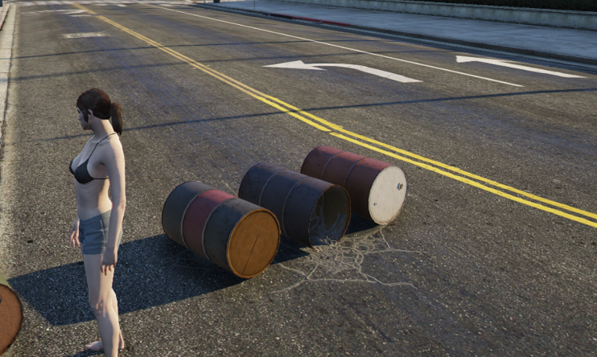

# Objects

Objects are well... objects. They're things on the map like ATMs, Boxes, etc.



## Global Object

Global objects can be seen by all players.

```ts
import { useRebar } from '@Server/index.js';

const Rebar = useRebar();

// Create the object
const object = Rebar.controllers.useObjectGlobal({ model: alt.hash('prop_barrel_pile_02'), pos: Vector3.zero });

// Update object
object.update({ pos: new alt.Vector3(0, 0, 0) });

// Destroy the global object
object.destroy();
```

## Local Object

Local objects can only be seen by a single player.

```ts
import { useRebar } from '@Server/index.js';

const Rebar = useRebar();

// Create the object
const object = Rebar.controllers.useObjectLocal(somePlayer, {
    model: alt.hash('prop_barrel_pile_02'),
    pos: Vector3.zero,
});

// Update object
object.update({ pos: new alt.Vector3(0, 0, 0) });

// Destroy the local object for the player
object.destroy();
```
