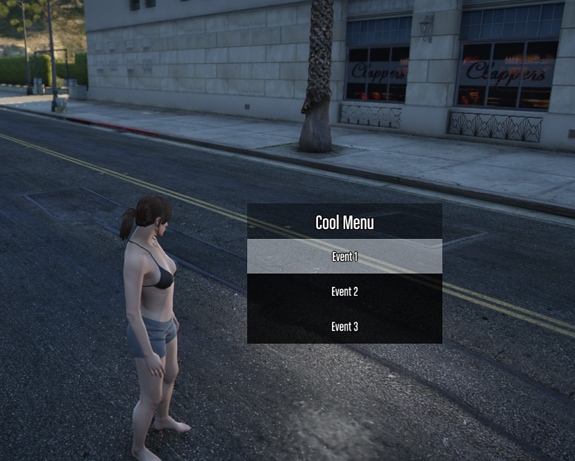

# World Menu

World menus are 3D menus that can exist in the world, and can be popped up at any time.

They're meant for quickly selecting options, and getting results on either server or client-side.

In the case here, it's server-side usage.



```ts
async function showSomeMenu(player: alt.Player) {
    const worldMenu = Rebar.controllers.useWorldMenu({
        title: 'Cool Menu',
        pos: player.pos,
        options: [
            {
                event: 'event-1',
                name: 'Event 1',
                args: 0,
            },
            {
                event: 'event-2',
                name: 'Event 2',
                args: 1,
            },
            {
                event: 'event-3',
                name: 'Event 3',
                args: ['a', 'b', 'c'],
            },
        ],
    });

    const result = await worldMenu.show(player);

    // Returns { event, args }
    console.log(result);
}
```
