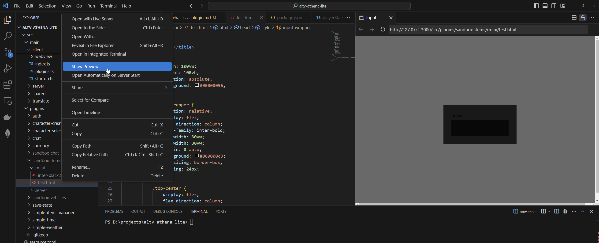

# Plugin Structure

If you wish to create plugins then you need to understand the basic structure of a plugin.

1. Create a folder inside `src/plugins` and name it something unique
2. Create these additional folders under the new folder you created (not all are necessary)
    1. `client`
    2. `images`
    3. `server`
    4. `sounds`
    5. `translate`
    6. `webview`
    7. `dependencies`
    8. `shared`
    9. `rmlui`
    10. `fonts`

[!embed](https://www.youtube.com/watch?v=_bnf-duy3mI)

## client

This is where the client-side code belongs. You **cannot use NPM packages** in these files.

Ensure that you create an `index.ts` file as an entry point for your client code.

```ts
// client/index.ts
import * as alt from 'alt-client';
import '../translate/index.js';
import { useTranslate } from '@Shared/translate.js';

const { t } = useTranslate('en');

alt.log(t('example.hello-from-client'));
```

## server

This is where server-side code belongs.

Ensure that you create an `index.ts` file as an entry point for your server code.

```ts
// server/index.ts
import * as alt from 'alt-server';
import '../translate/index.js';
import { useTranslate } from '@Shared/translate.js';

const { t } = useTranslate('en');

alt.log(t('example.hello-from-server'));
```

## shared

This is where shared code (constants, events) belongs.<br/>
Code below is just example. In `shared` folder you can store anything you want, that is used by both, clientside and serverside code.

```ts
// shared/events.ts
export const MyPluginEventNames = {
    ToServer: {
        FirstToServerEvent: 'myplugin.serverEvent',
    },
    ToClient: {
        FirstToClientEvent: 'myplugin.clientEvent',
    },
};
```

## images

Images are any images with the following extensions: `jpg, jpeg, png, bmp, svg, webp`.

Additionally, the images are loaded as an `asset-pack` and copied to the `webview/public/images` folder as well.

Image paths are absolute so if you put an image in the `images` folder then your `html` path will be `./images/myplugin-myimage.png`.

If you need the image for rmlui then your path will be `http://assets/images/myplugin-myimage.png`.

```jsx


// OR


```

!!!
Image names need to be unique for your individual plugin, otherwise they will override each other.
!!!

## rmlui

[RmlUi](https://docs.altv.mp/articles/rmlui/introduction.html) is a way to write HTML pages with css2 support. They're highly performant, but can be hard to work with.

In Rebar we just create normal `html` files but abide by CSS2 support. Confused? Check out these [docs](https://mikke89.github.io/RmlUiDoc/pages/rcss.html).

Rmlui pages and fonts can be loaded with the following paths:

-   `@rmlui/plugins/your-plugin/index.rml`
-   `@rmlui/plugins/your-plugin/font.ttf`

That being said, create a file under the path `plugins/your-plugin/rmlui/index.html` or whatever you want, and add the following content:

```html
<html>
    <head>
        <title>Input</title>
        <style>
            text {
                color: #ffffff;
            }
        </style>
    </head>
    <body id="body">
        <div id="text">Hello World!</div>
    </body>
</html>
```

You can also add custom fonts under `plugins/your-plugin/rmlui` as long as they're in `ttf` format.

If you want live previews of your `html` check out [VSCode Live Server Extension](https://marketplace.visualstudio.com/items?itemName=ms-vscode.live-server). Once it's installed you can `right-click` your `html` file and click `Show Preview` to preview it in VS Code!



## sounds

Sounds are custom `.ogg` files that can be played as an asset using the `Rebar.player.useAudio` function.

Additionally, the images are loaded as an `asset-pack` and copied to the `webview/public/sounds` folder as well.

Here's a simple example of playing a sound called `myplugin-test.ogg` which is in the `sounds folder`.

### Server Sound

```ts
import * as alt from 'alt-server';
import { useRebar } from '@Server/index.js';

const Rebar = useRebar();

alt.on('playerConnect', async (player) => {
    Rebar.player.useAudio(player).playSound('http://assets/sounds/myplugin-test.ogg');

    // Alternatively
    Rebar.player.useAudio(player).playSound('./sounds/myplugin-test.ogg');
});
```

### Webview Sound

```tsx
<script lang="ts" setup>
import { useAudio } from '../../../../webview/composables/useAudio';

const audio = useAudio();

function playSound() {
    audio.play('./sounds/myplugin-test.ogg');
}
</script>

<template>
    <div>
        <button @click="playSound">Click Me!</button>
    </div>
</template>

```

## translate

Translations can be used on `client-side`, `server-side`, or `webview` as long as you import the translation file.

```ts
// translate/index.ts

// It is recommended to use relative paths for translation imports
import { useTranslate } from '@Shared/translate.js';
const { setBulk } = useTranslate();

setBulk({
    en: {
        'example.hello-from-server': 'Hello from server-side!',
        'example.hello-from-client': 'Hello from client-side!',
        'example.hello-from-webview': 'Hello from webview!',
    },
});
```

## webview

Webview pages should always have unique names that differentiate from other plugins. Ensure you give your `vue` file a unique name.

```ts
// MyPluginExample.vue
<script lang="ts" setup>
import '../translate/index';
import { useTranslate } from '../../../main/shared/translate';

const { t } = useTranslate('en');

console.log(`Hello from webview`);
</script>

<template>
    <div>
        <div class="text-red-500 text-lg">{{ t('example.hello-from-webview') }}</div>
    </div>
</template>
```

## Extending built-in interfaces

Imagine, you want to add a new attribute to already existing document, like Vehicle.

To not rewrite Rebar's interface, you can use this approach:

```ts /plugins/my-awesome-plugin/server/index.ts
import '@Shared/types/vehicle.js';

// Your code here.

declare module '@Shared/types/vehicle.js' {
    export interface Vehicle {
        mileage: number;
        plateNumber: string;
    }
}
```

This approach will allow you to use defined keys everywhere.

After that, in any plugin, you'll be able to use:

```ts /plugins/my-new-plugin/server/index.ts
import * as alt from 'alt-server';
import { useRebar } from '@Server/index.js';

const Rebar = useRebar();

const vehicleDocument = getOrCreateVehicleDocument(); // Your own implementation

const vehicle = alt.Vehicle(alt.hash(vehicleDocument.model), 0, 0, 0, 0, 0, 0);
const boundVehicle = Rebar.document.vehicle.useVehicleBinder(vehicle).bind(vehicleDocument);

vehicleWrapper.getField('mileage'); // You will see type hint there, that you're able to use 'mileage' and 'plateNumber'.
vehicleWrapper.set('mileage', 1000); // Also here
```

## Dependencies

If you noticed a plugin can use npm packages for the webview or server.

!!!
It is recommended to avoid using packages where possible to keep everything 'future proofed'
!!!

Simply add a `dependencies.json` or `package.json` to your plugin folder.

Add a section called `dependencies` and it will automatically install the dependencies the next time you run your server.

```json
{
    "dependencies": {
        "@formkit/auto-animate": "latest"
    }
}
```

## fonts

Fonts are any files with the following extensions: `otf, ttf`.

Additionally, the fonts are loaded as an `asset-pack` and copied to the `webview/public/fonts` folder as well.

Image paths are absolute so if you put an image in the `fonts` folder then your `html` path will be `./fonts/myfont.ttf`.

If you need the image for rmlui then your path will be `http://assets/fonts/myfont.ttf`.
