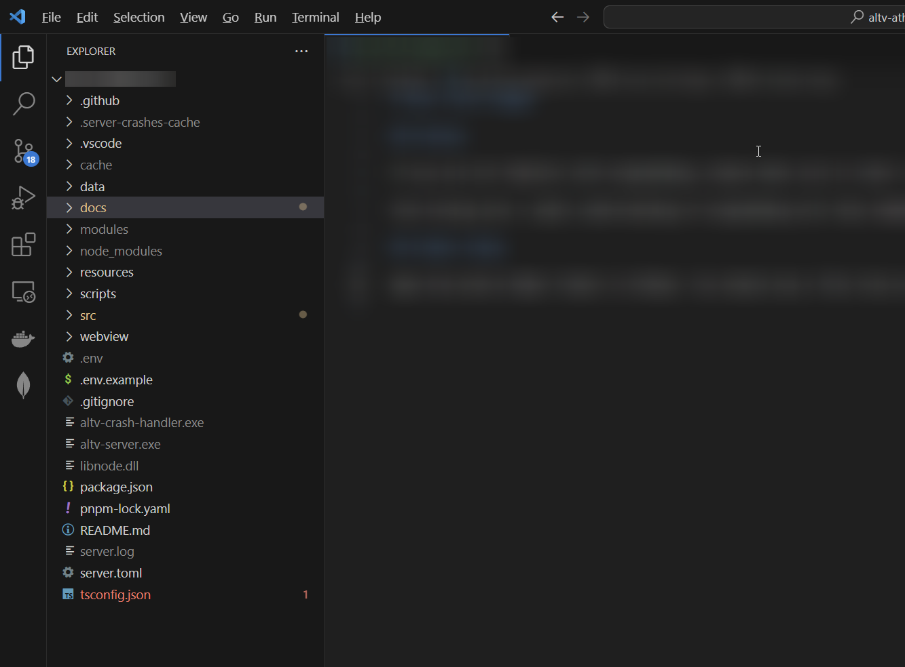
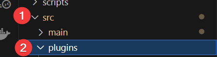
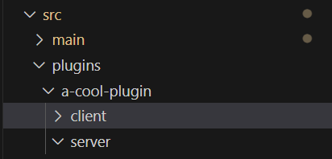
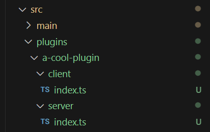
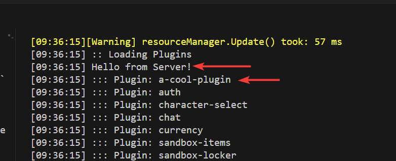

# Your First Plugin

This tutorial is meant to show you how to get an incredibly basic plugin running.

It will not show you how to use the API, or anything else. It's strictly to show you how to setup a plugin.

## Preface

If you are not familiar with programming, please make sure to check out [Basic Programming](../../tutorials/rebar/chapter-07-programming.md) before starting.

Even having just a small understanding of programming will help immensely.

## Client Setup

Before starting, make sure you have [alt:V Installed](https://altv.mp) and modify the `altv.toml` to turn `debug` to true.

You can read more about that [here](https://docs.altv.mp/articles/configs/client.html).

## Folder Setup

Open the entire Rebar Folder in VSCode. You should see a file tree on the left with all of your files.



### Accessing Plugin Folder

Navigate based on the following folders:

```
src/plugins
```



### Create a New folder

Create a new folder by right-clicking the `plugins` folder and making one.

Name the folder whatever you want, but it needs to be in English.

For the sake of this tutorial, I named mine `a-cool-plugin`.

### Create 2 New Folders

Create 2 new folders inside of `a-cool-plugin` and name them `server` and `client`.



### Create 2 New Files

You are going to now create 2 files named `index.ts` inside both `server` and `client`.



## Setup TypeScript Files

Now that you have your files created, we need to add some content to both of them.

Make sure to **save your files** after editing them!

`CTRL + S` will save your file.

### server/index.ts

Inside of this file add the following contents.

```ts src/plugins/your-plugin/server/index.ts
import * as alt from 'alt-server';
import { useRebar } from '@Server/index.js';

const Rebar = useRebar();

alt.log('Hello from Server!');
```

### client/index.ts

Inside of this file add the following contents.

```ts src/plugins/your-plugin/server/index.ts
import * as alt from 'alt-client';

alt.log('Hello from Client!');
```

## Testing the Plugin

In VSCode at the top, click on `Terminal` and then click `New Terminal`.

Simply run `pnpm dev` to start your server.

You will then see that your plugin has loaded, and you'll have some logs in your server console.



Additionally, you can see the result in your **client console in-game** which can be opened with `F8`.
