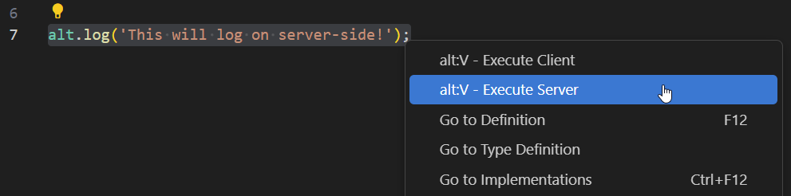

# VSCode Transmitter

Rebar has built in support for the `Rebar Transmitter` extension.

This allows you to open a scratchpad under `src/scratchpad` and write code.

Once the code is written you can `SELECT THE CODE WITH YOUR CURSOR` and then right-click to execute it while the server is running.

## Instructions

1. Open `src/scratchpad` folder
2. Rename both of the example pads to `serverExample.ts` and `clientExample.ts`
3. Write some code in the scratch pad
4. Highlight it
5. Right-click it, and execute it

## Example

## Download

[https://marketplace.visualstudio.com/items?itemName=stuyk.rebar-transmitter](https://marketplace.visualstudio.com/items?itemName=stuyk.rebar-transmitter)
