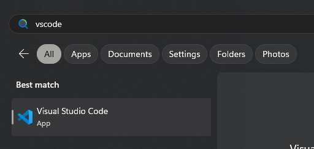

# Chapter 2. Dependencies

With every great project comes a list of dependencies and things you will need to get started. All of the dependencies below are required and you will need to obtain the necessary software to follow this book.

## Windows Terminal

If you don't already have it, obtain Windows Terminal. Windows Terminal will allow you to run various commands from... the terminal.

This means that while you are working with alt:V and Rebar, you will be asked to **run commands in a terminal**.

You can open a terminal by typing `terminal` into your Windows Search.


### Terminal Tip

If you want to get access to your terminal quickly, pin it to your task bar.


## Programs to Obtain

Your operating system should be Windows 11, or greater and you should install these programs in the order they are listed.

-   Windows 11
-   GTA:V Video Game, from one of these platforms
    -   https://store.steampowered.com/app/271590/Grand_Theft_Auto_V/
    -   https://www.rockstargames.com/gta-v
    -   https://store.epicgames.com/en-US/p/grand-theft-auto-v
    -   Keep in mind that pirated copies of GTA:V are **not supported**
-   alt:V Multiplayer Client
    -   This client is for connecting to alternative servers outside of GTA:V itself
    -   https://altv.mp/
-   git
    -   https://git-scm.com/downloads
-   Node.js v20+
    -   https://nodejs.org/
-   pnpm
    -   https://pnpm.io/installation
    -   If you have `node.js` installed you can just run `npm install -g pnpm` in a terminal
-   MongoDB Community Server
    -   https://www.mongodb.com/try/download/community
    -   When you install this program, use all of the default settings.
    -   You can verify the installation by checking the **Services** tab of your **Task Manager**
-   VSCode
    -   https://code.visualstudio.com/download

## Checking Installation

### git

Open a Terminal, and run the following command to verify git is installed.

```
git version
```

_If successful, you will see the git version printed_ to the console.

### Node.js

Open a Terminal, and run the following command to verify node.js is installed

```
npm --version
```

_If successful, you will see the git version printed_ to the console.

### pnpm

Open a Terminal, and run the following command to verify pnpm is installed

```
pnpm --version
```

### MongoDB Community Server

Open your Task Manager by `right-clicking` your `task bar` at the bottom of your screen, and navigating to the `Services` tab.

Search for `mongodb` in the top bar, and verify that the `status` is `Running`.


### VSCode

You can verify VSCode is installed by searching for the application in your `Start Menu`. Simply type VSCode, and try opening the program by clicking on it. Ensure that it boots up, and runs correctly.


