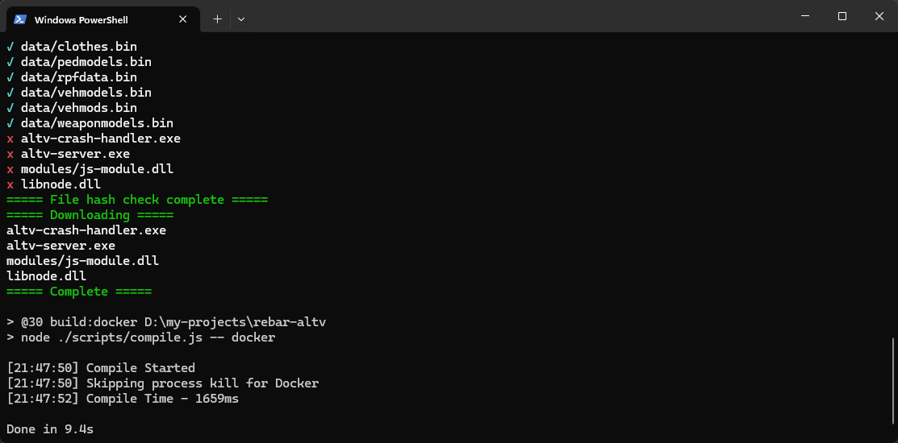

# Chapter 3. Project Setup

Now that we've obtained all the necessary programs to get started with development, we can begin with setting up our project.

## Cloning the Repository

Cloning a repository means you're going to download some source code from a GitHub website, in the case here we'll be cloning the Rebar repository into some location on our computer. For the sake of this book, I'm cloning the repository into a separate disk `D:` drive under the location `D:/projects/rebar-altv`.

Right-click the base folder where you wish to clone the repository, and click `Open in Terminal`. This will open the terminal in the current directory that you have open.

**Ensure you do not clone it to any folders with spaces, or special characters. **


Now run the follow command in the `Terminal` to clone the repository.

```
git clone https://github.com/Stuyk/rebar-altv/
```

_You may or may not be prompted to make a GitHub account, if you are. Make one and sign into it._

## Navigate to Repository

In the same `Terminal` you are going to `cd` into that directory.

`cd` means you are going to navigate into the directory from the `Terminal`.

```
cd rebar-altv
```

## Install Dependencies

You are now going to use the `Terminal` to install dependencies for Rebar.

```
pnpm install
```

If you hit an error during any of this setup, please visit the Rebar Discord. You can find a link to the Discord on the main Rebar page.

If successful, you will install and do the following with one command:

1. npm packages used by node.js
2. alt:V Server Binaries for Windows
3. Compile the Code Once

Here's an example of a successful installation.



## Running the Server

With that all said and done, we will be using the `Terminal` to **Start and Stop** the server. We want to verify that everything is loading correctly throughout the entire framework.

We'll be using `dev` mode to ensure the server starts. Use your `Terminal` to run the following command.

```
pnpm dev
```

Your console should output a similar output to what you see below, if all resources are `Loaded` then you are successful!

Additionally, when you start modifying source code **your development server will automatically reload and reconnect your game**.


## Configuring alt:V Client

When you are working on a server, you are more often than not going to want to run your alt:V client with `debug` set to `true`.

Open your alt:V Client folder where it's installed. Usually it's under the following path:

```
C:\Users\your-username-here\AppData\Local\altv
```

Open `altv.toml` in VSCode, you can do this by `right-clicking` the file and clicking `Open with Code`.


Make sure to **SAVE THE FILE** and then restart your alt:V client.

## Connecting to the Server

Once you have the server running in the above steps, you can `Direct Connect` to your server with the following IP by opening the alt:V Client and using the in-game interface to connect to your server.

Additionally, **you may not see anything when you connect, or be able to do anything**. Rebar does not spawn you into the game, and we just want to verify that we can connect to the server.

```
127.0.0.1:7788
```

_If you are having trouble connecting, visit the alt:V Discord on the main website, and ask for help_

## Shutting Down the Server

In the same terminal where you are running the server, click on it, and simply press `CTRL + C` multiple times to kill the server.

If you need to clear the console of all text you can use `CTRL + L` to clear the console.

## Recap

When we want to run the server we open a Terminal and type:

```
pnpm dev
```

When we want to shut down the server we press `CTRL + C` while focused on the Terminal.

When we want to clear the Terminal we press `CTRL + L` while focused on the Terminal.

Additionally, if you wish to run the server in production mode you can use:

```
pnpm start
```
