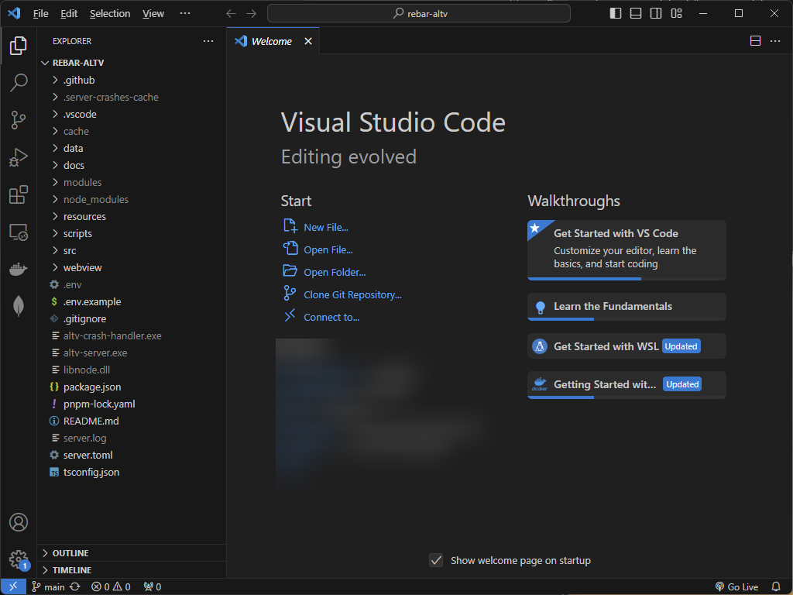
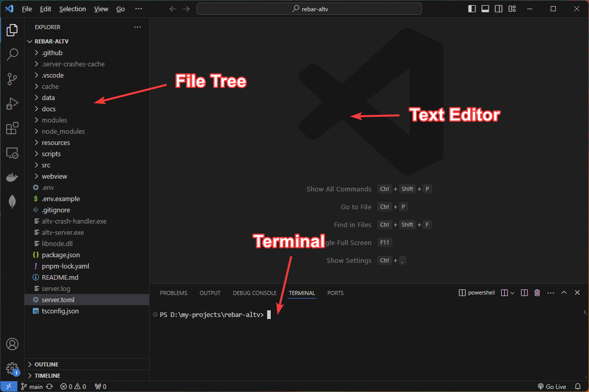

# Chapter 4. Opening the Source Code

Now that we've covered starting and stopping the server, it's time to get into the source code. This part may be incredibly overwhelming for people who have never programmed anything before. You are going to see a lot of files, and a lot of confusing controls.

I'll try and cover what you're seeing in this section as much as possible so that you can move forward with ease.

Let's begin.

## How to open the codebase

Where you installed the core of rebar, you can right-click the folder and `Open with Code`. This will open the whole folder in VSCode and give you a giant file tree, with a big window in the center.

Here's an example of what that looks like.

## What are you looking at?

Under `Explorer` is your File Tree for the whole folder. This is what makes Rebar come together.

In the center of the screen is likely a `Welcome Screen` and usually a `Text Editor` to modify source code.

## Open a Terminal in VSCode

The menu at the `top left` is going to let you access various options.

If you open the `...` menu, or click on `Terminal` you can open a `Terminal` inside of VSCode.

Get used to doing this, it's really useful to have a Terminal Open in VSCode.

## Setup VSCode for Rebar

One of the first things you are going to do is open the `Extensions` tab on the left side. It's the 4 squares.

Install the following extensions, insert their ids into the search bar:

-   mongodb.mongodb-vscode
-   esbenp.prettier-vscode
-   YoavBls.pretty-ts-errors
-   Vue.volar
-   bradlc.vscode-tailwindcss

You will not likely notice anything after installing these extensions, this is just to set us up for later.

## Recap

We have now opened the code base, and we can begin looking into working with Rebar. Especially if we want to make our first plugin.

You learned how to open a `Terminal` in VSCode, and install extensions.

Additionally, you can try running the server from inside VSCode to see if it starts.

**Make sure to close your previous instance in the other Terminal**.
