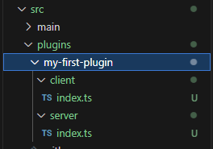
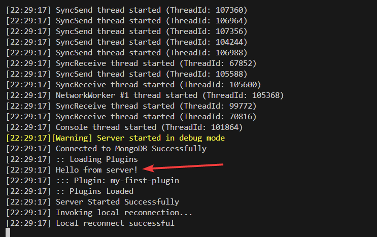

# Chapter 5. Your First Plugin

Now that we've gotten this far, we can write our first plugin for Rebar. Pay close attention to what you're doing and try to follow the images and text as closely as possible.

## Create your Plugin Folder

Run the following command(s) in your `Terminal`:

```
mkdir src/plugins/my-first-plugin
```

```
mkdir src/plugins/my-first-plugin/server
```

```
mkdir src/plugins/my-first-plugin/client
```

_Alternatively, feel free to use the file tree to create your plugin under the `src/plugins` folder._

## Create your Index Files

Index files are the main entry points for both `server` and `client`. We are going to create an `index.ts` file in both directories.

Run the following command(s) in your `Terminal`, and press `Enter` again after entering it:

```
echo > src/plugins/my-first-plugin/server/index.ts
```

```
echo > src/plugins/my-first-plugin/client/index.ts
```

_Alternatively, feel free to use the file tree to create your `index.ts` files under the `src/plugins/my-first-plugin` folders._

Here's a preview of what you should have as a folder structure.



## Setup server/index.ts

Inside of our `server/index.ts` file we're going to need to add some source code. Copy and paste the following code to get the initial setup ready.

```ts
import * as alt from 'alt-server';
import { useRebar } from '@Server/index.js';

alt.log('Hello from server!');
```

## Setup client/index.ts

Inside of our `client/index.ts` file we're going to add some client source code. Copy and paste the following.

```ts
import * as alt from 'alt-client';

alt.log('Hello from client!');
```

## Run the Server!

Run your server, and you can do that by running the following in a `Terminal`.

```
pnpm dev
```

While this may not seem like much for our first plugin, it will print some data to your client console `F8` in-game.

We can also find the printed data in our server console as well.

If you are successful, you will see `Hello from server!` printed in the console.


