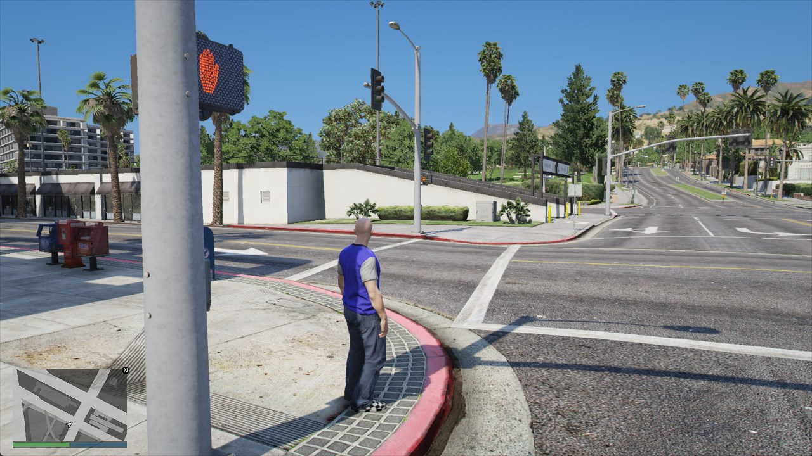
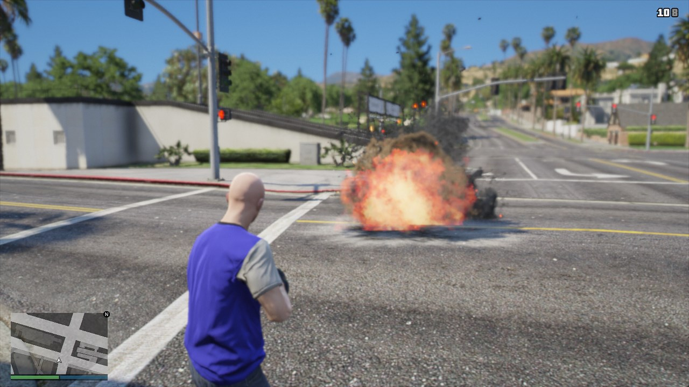

# Chapter 6. Expanding the Plugin

The next stage of our plugin is going to be spawning the player. While Rebar does come with plenty of plugins to handle this, we're going to be going from scratch to get a better understanding of how to work with Rebar as a whole.

Let's go ahead and spawn the player when they connect to the server.

## Spawn the Player

Modify the `server/index.ts` file for your plugin.

You are going to create an `alt.on` event which will be triggered when the player connects to the server.

We'll then spawn the player with the model `mp_m_freemode_01`

```ts
import * as alt from 'alt-server';
import { useRebar } from '@Server/index.js';

// This creates a world position using alt.Vector3 class. You can specify coordinates
const spawnPosition = new alt.Vector3({ x: -864.1, y: -172.6, z: 37.8 });

// This is an alt:V event that triggers when the player connects
alt.on('playerConnect', (player) => {
    // We are using the player variable above as a reference

    player.model = 'mp_m_freemode_01'; // We are assigning the model

    player.spawn(spawnPosition); // We are spawning the player at the spawnPosition variable
});
```

### Verify Results

Head in-game and verify that you spawn at the given location, and you have a model loaded for your player. At this stage you should be able to move around in-game and walk around in an empty world.



## Give the Player a Weapon

Let's modify that source `alt.on` event so that when they spawn it also gives them a gun. Here's a few weapon models you can use.

-   WEAPON_GRENADELAUNCHER
-   WEAPON_BATTLEAXE
-   WEAPON_RAYPISTOL

Let's add one weapon first, and then **you can modify the source code to add all of them.**

```ts
import * as alt from 'alt-server';
import { useRebar } from '@Server/index.js';

const spawnPosition = new alt.Vector3({
    x: -864.1437377929688,
    y: -172.6201934814453,
    z: 37.799232482910156,
});

alt.on('playerConnect', (player) => {
    player.model = 'mp_m_freemode_01';
    player.spawn(spawnPosition);

    // We are now giving the player a grenade launcher, with 999 ammo, and equipping it immediately
    player.giveWeapon('WEAPON_GRENADELAUNCHER', 999, true);

    // Try giving more weapons here, use the models above
});
```

### Verify Results

Head in-game and verify that you can select weapons with `Tab` and you can shoot those weapons as well.



## Wait a Minute!

We're already writing some basic code to do some basic things in-game. Yet you may have no idea what kind of code you're writing and what that code does.

While, it may seem like we're reading plain English, our next section is going to explain more about how programming works.

For now, this is just a taste of what we'll be able to do soon enough.
