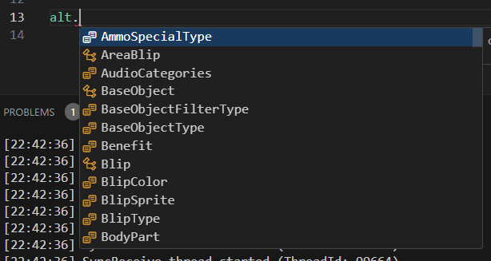
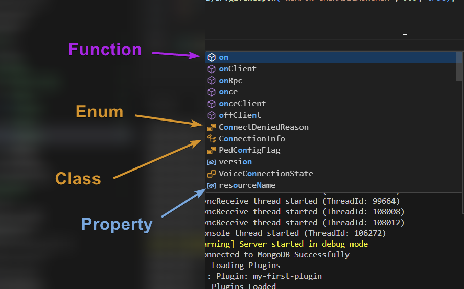
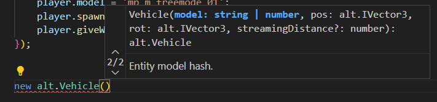
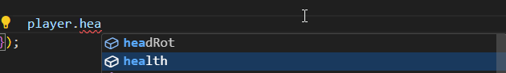
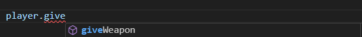
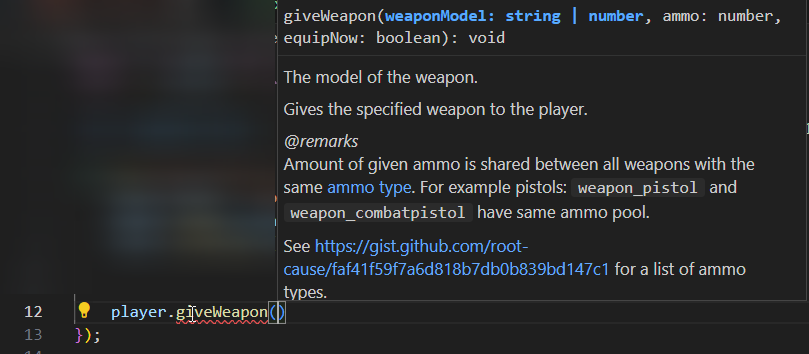
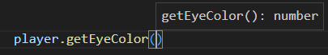

# Chapter 7. Programming

In our previous section we created our first plugin, spawned a player, and gave them a weapon. In this section, we're going to learn how to do some basic programming, and how to know what to type based on the patterns you're seeing.

Don't try to overthink what you're seeing here in this section, you may need to come back to it for a refresher or maybe you need a little more help by looking at [some more examples](https://learnxinyminutes.com/docs/typescript/).

What is important is that you give it time, and practice often. You obtain nothing if you do nothing.

> Do or do not. There is no try.
>
> \- Yoda

## Basics

Variables are the bread and butter for programming, variables store different data types. We've already used one variable to store an `alt.Vector3` inside of it.

```ts
let spawnPosition = new alt.Vector3({
    x: -864.1437377929688,
    y: -172.6201934814453,
    z: 37.799232482910156,
});
```

But variables can store just about anything inside of them. Here's a few examples of what that looks like for types like `strings`, `numbers`, `objects`, `interfaces`, and `arrays`.

### Variables

Variables can be declared as `let` or `const` depending on what is needed.

If the value is not meant to change, we use `const`. If the value is meant to change we use `let`.

```ts
// Not meant to change
const spawnPosition = new alt.Vector3({
    x: -864.1437377929688,
    y: -172.6201934814453,
    z: 37.799232482910156,
});

// Mean to be changed
let count = 0;
count += 1;
```

### Strings

```ts
// We use 'let' to declare a variable of the string type, and give it a name.
let myVariable: string;

// We can assign a variable with '='
let anotherVariable = 'hello world';

// We can change that same variable by not using 'let'
anotherVariable = 'hello';

// We can add another string to the current variable by using +
anotherVariable = 'hello' + 'world';

// We can add two variables together by using + as well
let variableHello = 'hello';
let variableWorld = 'world';

// Variable contains 'hello world'
let result = variableHello + ' ' + variableWorld;
```

### Numbers

```ts
// Again, we use 'let' to declare a variable of the number type, and give it a name
let myNumber: number;

// We can assign a variable with '='
let anotherNumber = 5;

// We can change that same variable
anotherNumber = 10;

// We can add more to that variable, which results in the variable being 15
anotherNumber += 5;

// We can subtract from that variable, which results in 5
anotherNumber -= 10;

// We can multiply that variable which results in 10
anotherNumber *= 5;

// We can divide that variable which results in 5
anotherNumber /= 2;

// We can use all the operators to add, subtract, multiply, or divide two variables together
let numberA = 5;
let numberB = 5;

let result = numberA + numberB;
let result2 = numberA * numberB;
let result3 = numberA / numberB;
let result4 = numberA - numberB;
```

### Booleans

Booleans are a great way to see if something is true or false.

```ts
let isRaining = true;
let isCloudy = true;

// Booleans can also be created by comparing or combining types.
let isBadWeather = isRaining && isCloudy;

// We can also make booleans out of numbers
let value1 = 5;
let value2 = 10;

// Is value 2 greater than, value 1
let isValue2Larger = value2 > value1; // true

// Is value 1 less than, value 2
let isValue1Smaller = value1 < value2; // true

// Are these the same values?
let isValueSame = value1 === value; // false
```

### Objects

Objects can be incredibly complex, so this is just the basics of declaring and modifying them.

```ts
// Objects can be delcared with {}
let myObject = {};

// Objects can contain any amount of data
const myObject = {
    name: 'Kirk',
    age: 30,
};

// Objects can have that data changed at any time
myObject.name = 'Kirk Shepfield';
myObject.age = 25;

// Objects can also contain more objects
const newObject = {
    name: 'Kirk',
    age: 30,
    data: {
        address: '127.0.0.1',
    },
};

// Those objects inside objects can also be modified
newObject.data.address = '0.0.0.0';
```

### Interfaces

While objects are great, they aren't great without an interface. An interface lets you determine the expected structure of ran Object.

```ts
// You can declare an interface like this
interface User {
    // notice how this uses a string
    name: string;
    // this uses a number
    age: number;
    // this uses an object
    data: {
        // and this uses a string
        address: string;
    };
}

// Now we can declare an object that uses this interface specifically
// Sometimes your IDE will complain, if interface does not match
const user: User = {
    name: 'Kirk',
    age: 25,
    data: {
        address: 'everywhere',
    },
};

// We can also make interfaces with optional values by using '?'
interface UserOptional {
    // notice how this uses a string
    name: string;
    // this uses a number
    age: number;
    // this uses an object
    data?: {
        // and this uses a string
        address: string;
    };
}

// Now we can delcare this user without declaring 'data'
const user2: UserOptional = {
    name: 'Kirk',
    age: 25,
};

// Neat!
```

### Arrays

Arrays are a group of strings, objects, numbers, or other types. They are often represented by a type `[]`

```ts
// Let's declare some fruit in an array as a string array with string[]
let fruits: string[] = ['apple', 'orange', 'banana'];

// I want to get the first element of our fruits array
console.log(fruits[0]); // This will get the first element of the array, which is apple

// I want to get the second element of our fruits array
console.log(fruits[1]); // This will get the second element, which is orange

// I want to get the last element of our fruits array, without knowing the length
console.log(fruits[fruits.length - 1]); // This will get the last element in the array, the banana

// I want to remove the last element in the array
let banana = fruits.pop();

// I want to remove the first element in the array
let apple = fruits.shift();

// I want add both fruits back in
fruits.push('banana');
fruits.push('apple');

// Our array is now ['orange', 'banana', 'apple']
// I want to remove banana from the array, but it's in the middle
let index = fruits.findIndex((x) => x.includes('banana'));
let banana = fruits.splice(index, 1);

// Our array is now ['orange', 'apple']
// Let's print all the elements in our array
for (let fruit of fruits) {
    // fruit is used as our iterator for the array, it will print orange, and then apple
    console.log(fruit);
}

// Neat!
```

### If Statements

If statements can be seen as your logical operators to help make your code do certain things. It's effectively like stating if you have a chocolate bar, do you eat the whole thing now, or do you eat it later. Then you tell the computer exactly what to do with the chocolate bar.

```ts
// Basic If Statement
let isRaining = true;
if (isRaining) {
    console.log('Take an umbrella!');
}

// If-Else Statement
let isSunny = false;
if (isSunny) {
    console.log('Wear sunglasses!');
} else {
    console.log('No need for sunglasses.');
}

// If-Else If-Else Statement
let temperature = 30;
if (temperature > 30) {
    console.log("It's hot!");
} else if (temperature < 10) {
    console.log("It's cold!");
} else {
    console.log("It's moderate.");
}

// Nested If Statements
let time = 14; // 2 PM
let isWeekend = true;
if (isWeekend) {
    if (time < 12) {
        console.log('Good morning!');
    } else {
        console.log('Good afternoon!');
    }
} else {
    console.log("It's a weekday.");
}

// Ternary Operator
let age = 18;
let canVote = age >= 18 ? 'Yes' : 'No';
console.log(canVote); // 'Yes'

// Combining Conditions
let isAdult = true;
let hasID = true;
if (isAdult && hasID) {
    console.log('Entry allowed.');
}

let isMember = false;
if (isAdult || isMember) {
    console.log('Discount applicable.');
}

if (!isMember) {
    console.log('Membership required.'); // Membership required
}
```

### Functions

Functions allow you to put re-useable code together to be called multiple times.

```ts
// Basic Function
function greet(name: string): void {
    console.log(`Hello, ${name}!`);
}
greet('Alice'); // Hello, Alice!

// Return Value
function add(a: number, b: number): number {
    return a + b;
}

const result = add(5, 3);

// Default Parameters
function greetWithDefault(name: string = 'Guest'): void {
    console.log(`Hello, ${name}!`);
}
greetWithDefault(); // Hello, Guest!
greetWithDefault('Bob'); // Hello, Bob!

// Rest Parameters
function sumAll(...nums: number[]): number {
    return nums.reduce((total, num) => total + num, 0);
}
console.log(sumAll(1, 2, 3, 4)); // 10
```

### Camel Casing

When you are declaring variables you should always `camelCase` them. This means that the first word is always lowercase, and all words thereafter are capitalized. `likeThisReallyLongSentence`.

However, this is just a general rule for JavaScript, and TypeScript. Try to abide by it so others can read your code quickly.

## Function Scope

Scope determines where certain variables and functions can be logged or executed.

### Global Scope

-   Variables declared outside any function or block
-   Accessible from anywhere in the code

```ts
let globalVar = "I'm global";

function printGlobalVar() {
    console.log(globalVar); // Accessible here
}

printGlobalVar(); // Output: I'm global
console.log(globalVar); // Accessible here as well
```

### Function Scope

-   Variables declared inside a function using `let`, or `const`
-   Accessible only within that function

```ts
function greet() {
    let message = 'Hello, World!';
    console.log(message); // Accessible here
}

greet(); // Output: Hello, World!
console.log(message); // Error: Cannot find name 'message'
```

### Block Scope

-   Variables declared inside a block (e.g., `{}`) using `let` or `const`.
-   Accessible only within that block.

```ts
if (true) {
    let blockScopedVar = "I'm block scoped";
    console.log(blockScopedVar); // Accessible here
}

console.log(blockScopedVar); // Error: Cannot find name 'blockScopedVar'
```

### Recap

-   **Global Scope**: Accessible anywhere
-   **Function Scope**: Accessible only within the function
-   **Block Scope**: Accessible only within the block

Understanding these scopes helps manage variable accessibility and avoid bugs.

## Intellisense

If you are not sure what intellisense is, it's the little helper in your text editor that will sometimes pop-up with suggestions.

Here's a picture of what that looks like.



There's a lot of confusing icons, and strange symbols throughout the entire suggestion. Let's break it down so you can understand what you're looking at more.



As you can see in the above image, it clearly explains what each icon is and what their name is. Now let's break down how each one of those works. Let's take a look at some common examples from `alt:V`.

### Class Type

Now we're going to focus on `alt.Vehicle` which is a `class`. A class can be described as a little `orange tree with roots`.

Usually when you see a `class` it needs to be be instantiated with the `new` keyword.

Let's take a look at what that may look like.

```ts
// As you can see below we've instantiated 3 different classes in a single line.
// 1 for the vehicle, 1 for the position, and 1 for the rotation of the vehicle.
const vehicle = new alt.Vehicle('infernus', new alt.Vector3(5, 5, 5), new alt.Vector3(0, 0, 0));
```



You can also see that our parameters are now matching perfectly.

It expected the following based on the screenshot above...

-   `model` of `string` type,
-   `pos` of `alt.Vector3` type,
-   `rot` of `alt.Vector3` type.

_Remember that a `?` means the argument, variable, or property may be optional_

### Property Type

Properties are always assigned with an `=` sign. A property can be described as a `small low blue box`.



As you can see above we see two properties, headRot and health. We're focusing on health though.

```ts
player.health = 200; // believe it or not player health goes between 99-200. <= 99 being dead
```

### Function Type

Functions usually require using `()` to make them function. The icon is often a `large purple box`.



When you open up the function with `()` you will get additional intellisense hints.



As you can see above it will take a `string or number`, `number` for ammo, and a `boolean` for equipNow.

```ts
player.giveWeapon('WEAPON_PISTOL50', 999, true);
```

Functions can also sometimes return data when executed, take a look at this `player.getEyeColor()` function.



That last parameter which says `: number` is the expected `ReturnType` for the function. So we can assume we'll be getting a `number` back from the function after it's executed.

```ts
const eyeColor = player.getEyeColor();
```

## Recap

While there's a lot to learn in programming, this will all eventually become second nature in your understanding as you proceed to work with the knowledge you've obtained every day. You must practice programming to be good at programming. It is a skill that can only be obtained by writing code, and dealing with the bugs.
