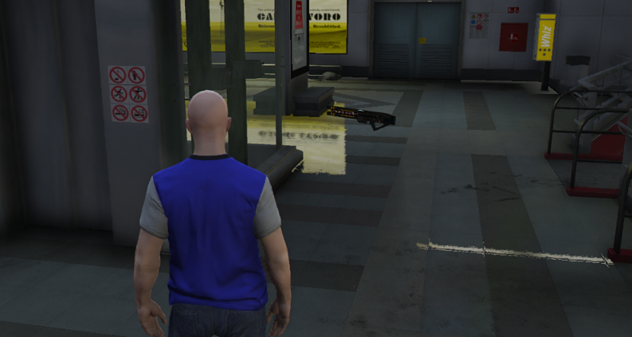
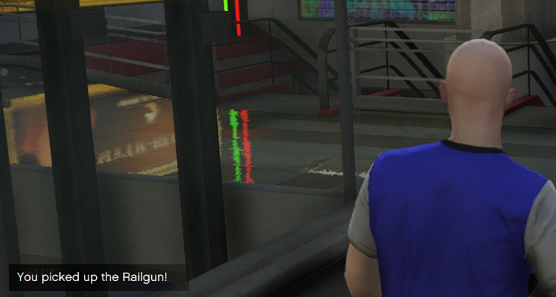
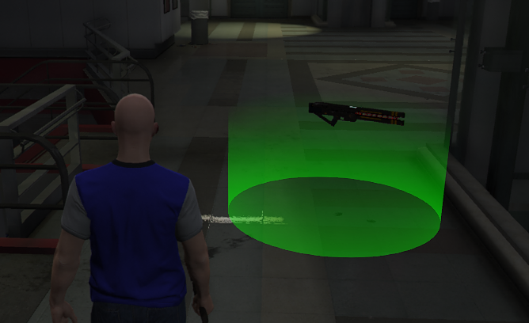
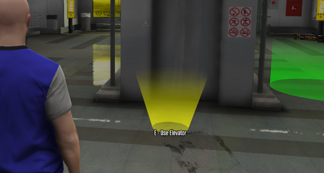

# Chapter 9. Free for All Death Match Gamemode

In this chapter we're going to build a very basic version of a free for all death match. It's going to require very little code, and in this section I'll provide a handful of positions and code to help you build this faster.

Death Match is perhaps one of the easiest game modes to write, and gives a firm understanding of spawning and death mechanics.

## Respawn System

### Spawn Positions

All of these positions are located in a subway station.

```ts
// server/index.ts

// This is a list of spawn points we can use
// They're all inside of the subway station
const spawns = [
    { x: -788.31, y: -122.15, z: 19.95 },
    { x: -845.725, y: -155.81, z: 19.95 },
    { x: -817.93, y: -139.22, z: 19.95 },
    { x: -810.61, y: -134.41, z: 19.95 },
    { x: -818.87, y: -130.96, z: 28.17 },
    { x: -810.09, y: -144.58, z: 28.17 },
];
```

### Spawn Randomly

Using some of the code we did in the `excercises` we can randomly spawn a player to a random position

Let's create a function to do that for us.

```ts
// server/index.ts

function spawnPlayer(player: alt.Player) {
    const index = Math.floor(Math.random() * spawns.length);
    player.spawn(spawns[index]);
}

alt.on('playerConnect', (player) => {
    player.model = 'mp_m_freemode_01';
    spawnPlayer(player);
});
```

### Handling Death

When we get killed, or when a player dies. They'll need to be respawned. We can use the alt event for `playerDeath` to handle that, and use the `spawnPlayer`

```ts
// server/index.ts

alt.on('playerDeath', (player) => {
    spawnPlayer(player);
});
```

### Giving Weapons

Now our next step in this process is making sure that all of the players are armed for this free-for-all death match. Let's go ahead and give each player a random weapon when we call the `spawnPlayer` function.

```ts
// server/index.ts

const weapons = ['WEAPON_BATTLEAXE', 'WEAPON_CROWBAR', 'WEAPON_BAT', 'WEAPON_RPG'];

function spawnPlayer(player: alt.Player) {
    const index = Math.floor(Math.random() * spawns.length);
    player.spawn(spawns[index]);

    const weaponIndex = Math.floor(Math.random() * weapons.length);
    player.giveWeapon(weapons[weaponIndex], 999, true);
}
```

### Testing Time

Now you can go in-game and test to make sure it works. If you want other players to join consider checking out this [Tutorial on playit.gg Tunneling](https://www.youtube.com/watch?v=c35GzxDrG5c) which will allow you to port forward for alt:V without port forwarding your router, and windows firewall.

If you wish to port forward your router, and firewall you need to open port `7788`.

## Pickups

In the previous chapter we learned the basics of writing a super simple game mode. However, this next chapter is going to start covering some enhancements that we can add to our free-for-all death match game mode. Which in this case will be weapon pickups.

First thing we're going to check is if we have `Rebar` available and imported into the free-for-all game mode.

```ts
import { useRebar } from '@Server/index.js';

const Rebar = useRebar();
```

Make sure this is located at the top of your `server/index.ts` file.

### What is a Pickup?

Pickups will allow you to listen for when a player walks over a given point, and then we can give them a weapon. They're often seen as a hovering weapon that will invoke a function when walked over. Let's build one.

They're found under the `Rebar.controllers.` pathway when writing code.

### Pickup Positions

Here are two pickup positions we can use to create a pickup with.

```ts
new alt.Vector3({
    x: -816.7376708984375,
    y: -138.48944091796875,
    z: 28.175315856933594,
});

new alt.Vector3({
    x: -811.4326171875,
    y: -135.86361694335938,
    z: 28.175315856933594,
});
```

### Create the Pickup

Below we're going to great a pickup based on a specific weapon type. Intellisense will hint you at the available pickups for you to utilize in your pickup creation.

```ts
// server/index.ts

Rebar.controllers.usePickupGlobal({
    pickup: 'PICKUP_WEAPON_RAILGUN',
    pos: new alt.Vector3({
        x: -816.7376708984375,
        y: -138.48944091796875,
        z: 28.175315856933594,
    }),
});
```

### Listen for the Pickup

Next we're going to tack on a `.on` function to the usePickupGlobal. When we create a `pickup` it will return a handful of functions we can use and `on` just so happens to be one.

```ts
// server/index.ts

Rebar.controllers
    .usePickupGlobal({
        pickup: 'PICKUP_WEAPON_RAILGUN',
        pos: new alt.Vector3({
            x: -816.7376708984375,
            y: -138.48944091796875,
            z: 28.175315856933594,
        }),
    })
    .on((player, weapon, destroy) => {
        player.giveWeapon('WEAPON_RAILGUN', 99, true);
    });
```

### Verify the Pickup Works

Next step is verifying that the pickup works. Go ahead and head in-game and walk over to the pickup location. The two positions are at the top of the subway platform.



### Notifying the Player

Now that we have the player picking up a weapon, we can also let them know they've picked up the weapon.

We can do this by slightly modifying the pickup controller.

```ts
// server/index.ts

Rebar.controllers
    .usePickupGlobal({
        pickup: 'PICKUP_WEAPON_RAILGUN',
        pos: new alt.Vector3({
            x: -816.7376708984375,
            y: -138.48944091796875,
            z: 28.175315856933594,
        }),
    })
    .on((player, weapon, destroy) => {
        player.giveWeapon('WEAPON_RAILGUN', 99, true);

        // the usePlayer function has a lot of functionality built into it
        // feel free to explore it with intellisense!
        const rPlayer = Rebar.usePlayer(player);
        rPlayer.notify.showNotification(`You picked up the Railgun!`);
    });
```



## Markers

Now that we've messed with some pickups, let's really show the player that the pickup's are there, and we can do that by using markers.

Markers are effectively colorful holograms to show a player something in the world.

### Marker Positions

We'll be using the same positions from the last section, but we'll be subtracting 1 from the z position.

```ts
// These were already subtracted
new alt.Vector3({
    x: -816.7376708984375,
    y: -138.48944091796875,
    z: 27.175315856933594,
});

// These were already subtracted
new alt.Vector3({
    x: -811.4326171875,
    y: -135.86361694335938,
    z: 27.175315856933594,
});
```

### Building a Marker

Markers have various types, and you'll see that when you fill in `type` with the `string` type, intellisense will give you more hints.

```ts
// server/index.ts

Rebar.controllers.useMarkerGlobal({
    type: 'CYLINDER',
    pos: new alt.Vector3({
        x: -816.7376708984375,
        y: -138.48944091796875,
        z: 27.175315856933594,
    }),
    color: new alt.RGBA(0, 255, 0, 100),
    scale: new alt.Vector3(2, 2, 1),
});
```



Look at that, now we have a nice marker to really draw the player to the location.

## Interactions

Interactions require the player to press the `E` key in-game for something to happen. They're effectively a super simple way to trigger a certain function when the key is pressed.

In this section we're going to build an interaction to use the elevator in the game. It will simply teleport the player from the top to the bottom of the subway station.

### Interaction Positions

```ts
// Elevator Top
new alt.Vector3({
    x: -815.67236328125,
    y: -134.51853942871094,
    z: 27.17535400390625,
});

// Elevator Bottom
new alt.Vector3({
    x: -815.7911376953125,
    y: -134.67520141601562,
    z: 18.95029067993164,
});
```

### Teleport to Top

First thing we're going to do is use the `Rebar.controllers` to create an interaction.

```ts
// server/index.ts

// This one is actually a bit different, you'll be creating a colshape inside of the interaction controller
// Also notice that the coordinates are passed manually, and not with a alt.Vector3
const elevatorTop = Rebar.controllers.useInteraction(new alt.ColshapeSphere(-815.67, -134.51, 27.17, 2), 'player');
```

After creating the interaction, we're going to listen for when it is interacted with.

Once the player has interacted with the top elevator position, we'll move them down to the bottom position.

```ts
// server/index.ts

elevatorTop.on((player) => {
    // Teleport to the bottom
    player.pos = new alt.Vector3({
        x: -815.7911376953125,
        y: -134.67520141601562,
        z: 18.95029067993164,
    });
});
```

Additionally, we're going to use a `cone marker` to show the player the entry point.

```ts
// server/index.ts

Rebar.controllers.useMarkerGlobal({
    pos: new alt.Vector3({
        x: -815.7911376953125,
        y: -134.67520141601562,
        z: 18.95029067993164,
    }),
    type: 'UPSIDE_DOWN_CONE',
    color: new alt.RGBA(255, 255, 0, 100),
    scale: new alt.Vector3(1, 1, 1),
});
```

### Teleport to Bottom

Now we're going to create the bottom elevator code, and it's going to utilize pretty much the opposite positions that we used above. Feel free to try writing it on your own before using the code below.

We'll build the interaction first.

```ts
// server/index.ts

// Build the interaction
const elevatorBottom = Rebar.controllers.useInteraction(new alt.ColshapeSphere(-815.79, -134, 18.6, 2), 'player');

// Listen for when the player press 'e' and teleport them to the point given
elevatorBottom.on((player) => {
    player.pos = new alt.Vector3(-815.79, -134.51, 27.17);
});

// Build the marker to show the player they can interact with it
Rebar.controllers.useMarkerGlobal({
    pos: new alt.Vector3({
        x: -815.67236328125,
        y: -134.51853942871094,
        z: 18.6,
    }),
    type: 'UPSIDE_DOWN_CONE',
    color: new alt.RGBA(255, 255, 0, 100),
    scale: new alt.Vector3(1, 1, 1),
});
```

## Text Labels

Now that we've created an elevator, our next step is going to be adding some text labels to elevator positions to really let the player know that they can press a key to go up and down the elevator.

We're going to use the `Rebar.controllers` pathway to build some new Text Labels.

### Elevator Up Label

Labels require passing a position, and some text.

```ts
// server/index.ts

Rebar.controllers.useTextLabelGlobal({
    pos: new alt.Vector3({
        x: -815.67236328125,
        y: -134.51853942871094,
        z: 18.6,
    }),
    text: `E - Use Elevator`,
});
```

### Elevator Down Label

We'll do the same as above, but we're just going to change the position.

```ts
// server/index.ts

Rebar.controllers.useTextLabelGlobal({
    pos: new alt.Vector3({
        x: -815.67236328125,
        y: -134.51853942871094,
        z: 27.17535400390625,
    }),
    text: `E - Use Elevator`,
});
```



## Timers

There are a lot of cases where you want something to happen after a certain period of time. Let's say that we only want the Railgun to be available every 15 seconds after it's picked up.

What we're going to do is make it so that when the Railgun is taken, it will destroy itself, and then it will create a timer to respawn the Railgun after 15 seconds.

### Pickup as a Function

We're going to adjust the existing Railgun code, and change it as follows.

```ts
// server/index.ts

function createRailgun() {
    let isTaken = false;

    // Move the marker for the Railgun into this function as well
    const marker = Rebar.controllers.useMarkerGlobal({
        type: 'CYLINDER',
        pos: new alt.Vector3({
            x: -816.7376708984375,
            y: -138.48944091796875,
            z: 27.175315856933594,
        }),
        color: new alt.RGBA(0, 255, 0, 100),
        scale: new alt.Vector3(2, 2, 1),
    });

    // Add the pickup creation function
    const pickup = Rebar.controllers.usePickupGlobal({
        pickup: 'PICKUP_WEAPON_RAILGUN',
        pos: new alt.Vector3({
            x: -816.7376708984375,
            y: -138.48944091796875,
            z: 28.175315856933594,
        }),
    });

    // We'll use the 'destroy' function from the callback to remove it
    pickup.on((player, weapon, destroy) => {
        // Make sure that nobody else can claim the railgun after it is claimed
        if (isTaken) {
            return;
        }

        isTaken = true;

        // Destroy the pickup
        destroy();

        // Destroy the marker
        marker.destroy();

        // Give the player the railgun
        player.giveWeapon('WEAPON_RAILGUN', 99, true);

        const rPlayer = Rebar.usePlayer(player);
        rPlayer.notify.showNotification(`You picked up the Railgun!`);
    });
}
```

### Respawn the Railgun

We will now modify the pickup.on `callback` to call the `createRailgun` after 15 seconds.

```ts
// server/index.ts

pickup.on((player, weapon, destroy) => {
    // Make sure that nobody else can claim the railgun after it is claimed
    if (isTaken) {
        return;
    }

    isTaken = true;

    // Destroy the pickup
    destroy();

    // Destroy the marker
    marker.destroy();

    // Give the player the railgun
    player.giveWeapon('WEAPON_RAILGUN', 99, true);

    const rPlayer = Rebar.usePlayer(player);
    rPlayer.notify.showNotification(`You picked up the Railgun!`);

    // Respawn the railgun after 15 seconds
    alt.setTimeout(createRailgun, 15000); // 15 Seconds as milliseconds
});
```

### Spawn the Railgun

Finally, we just need to call `createRailgun` somewhere in the file to create the initial railgun.

You can likely put this at the end of your file.

```ts
// server/index.ts

createRailgun();
```

## Recap on Death Match

In this section you learned about working with player connections, respawning, weapon pickups, markers, interactions, text labels, and timers. All of these functionalities are core to building almost anything with Rebar.

However, this is for a non-persistent game mode. Meaning that nothing is saved.

This chapter was simply a primer to building larger more complex features.
