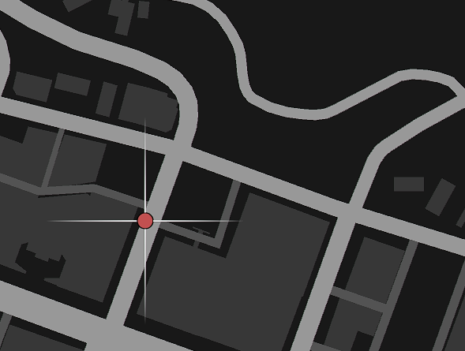
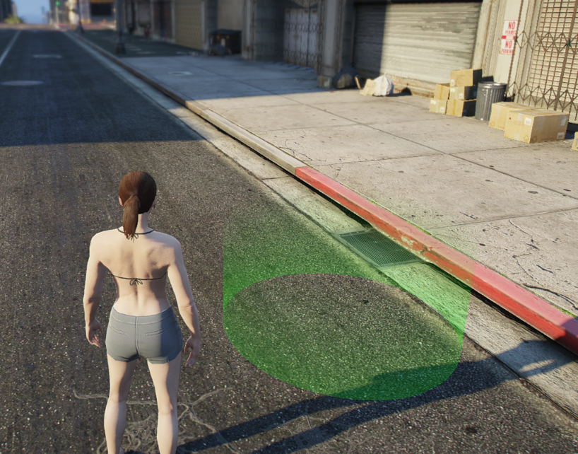
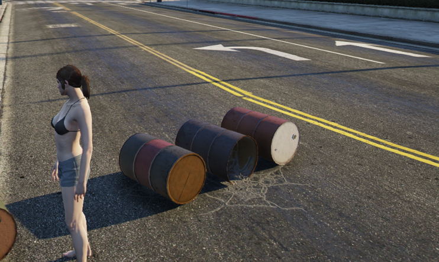
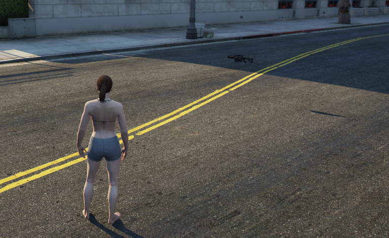
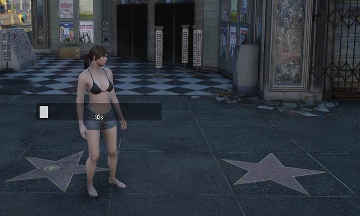
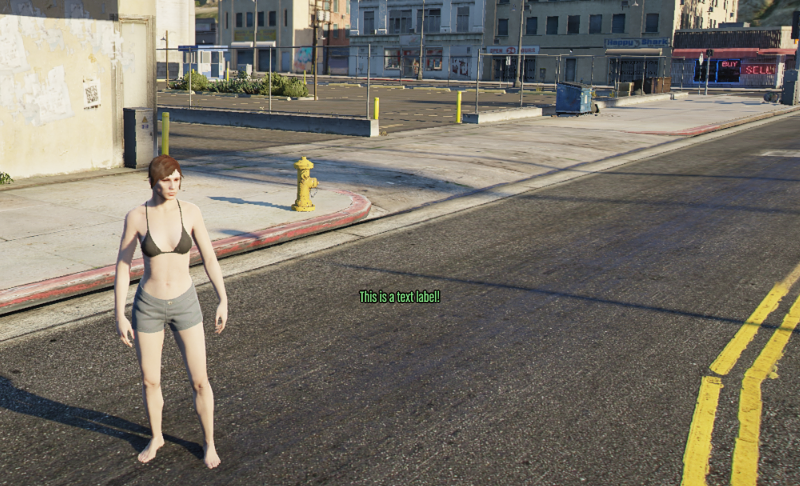
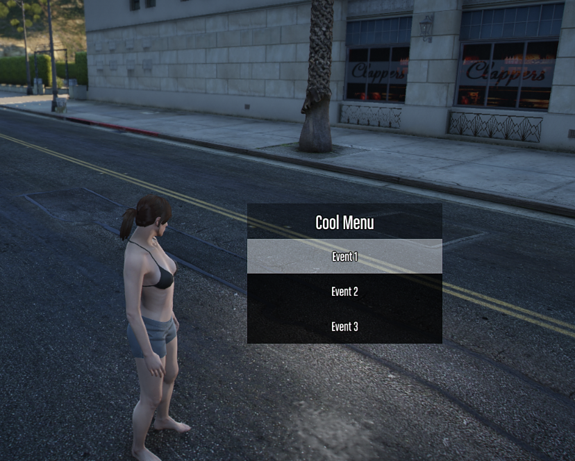

# controllers

Controllers effectively show and allow interactions throughout the game world for your players.

Controllers pretty much make your gamemode tick by displaying a lot information such as:

-   Blips
-   Markers
-   Interactable Positions
-   Menus
-   Text Labels
-   Doors
-   etc.

---

## Blips

Create a map marker that displays an icon, and text on the map.

!!!
These are general purpose blips, if you need more robust functionality use the blip directly.
!!!



### useBlipGlobal

A global blip can be seen by all players.

```ts
import { useRebar } from '@Server/index.js';
import { BlipColor } from '@Shared/types/blip.js';

const Rebar = useRebar();

// Create a global blip
const blip = Rebar.controllers.useBlipGlobal({
    pos: SpawnPos,
    color: BlipColor.BLUE,
    sprite: 57,
    shortRange: true,
    text: 'Spawn',
});

// Update the blip
blip.update({ pos: new alt.Vector3(0, 0, 0), text: 'New Text!' });

// Destroy the blip
blip.destroy();
```

Additionally, you can attach a blip to any entity like a player, or a vehicle like this.

```ts
const blip = Rebar.controllers.useBlipGlobal({
    color: 6,
    pos: player.pos,
    shortRange: true,
    sprite: 128,
    text: `${player.name}`,
});

blip.attach(player);
```

### useBlipLocal

A local blip can only been seen by a single player.

```ts
import { useRebar } from '@Server/index.js';
import { BlipColor } from '@Shared/types/blip.js';

const Rebar = useRebar();

// Create the blip locally
const blip = Rebar.controllers.useBlipLocal(player, {
    pos: SpawnPos,
    color: BlipColor.BLUE,
    sprite: 57,
    shortRange: true,
    text: 'Spawn',
});

// Update the blip
blip.update({ pos: new alt.Vector3(0, 0, 0), text: 'New Text!' });

// Destroy the blip
blip.destroy();
```

---

## D2D Text Labels

These are the most performant Text Labels that exist for alt:V.

These labels are specifically built for in-world use; and provide a way to synchronize with all players or some players.

### useD2DTextLabel

This example shows a message, and then changes the text to New Text!

```ts
const label = Rebar.controllers.useD2DTextLabel({
    pos: player.pos,
    text: 'Hey there!',
});

label.update({ text: 'New Text!' });
```

### useD2DTextLabelLocal

This example iterates through images passed through the `images` directory.

```ts
const label = Rebar.controllers.useD2DTextLabelLocal(player, {
    pos: player.pos,
    text: '',
});

let index = 1;
alt.setInterval(() => {
    index += 1;

    if (index >= 11) {
        index = 1;
    }

    label.update({ text: `` });
}, 50);
```

---

## Interactions

Interactions allow a player to walk up to an invisible trigger and press `E` to interact with it.

!!!
If using `player.pos` for your interaction, ensure you subtract `1` from the z axis to make it usable
!!!

### useInteraction

```ts
import { useRebar } from '@Server/index.js';

const Rebar = useRebar();

// Create an interaction
const interaction = Rebar.controllers.useInteraction(new alt.ColshapeCylinder(0, 0, 0, 5, 2), 'player');

// Listen for the player to hit 'E' to interact
interaction.on(handleInteraction);

function handleInteraction(player: alt.Player, colshape: alt.Colshape, uid: string) {
    alt.log(`${player.name} has interacted with ${uid}`);
}

// Message to show the player when they interact
// Use `undefined` or `null` to hide default messages
interaction.setMessage('enter', "Press 'E' to Interact");
interaction.setMessage('leave', 'You left the interaction...');

// Removing the interaction also destroys the colshape
interaction.destroy();

// Do something when the player enters the interaction
interaction.onEnter((player: alt.Player, colshape: alt.Colshape, uid: string) => {
    // someone entered
});

// Do something when the player leaves the interaction
interaction.onLeave((player: alt.Player, colshape: alt.Colshape, uid: string) => {
    // someone left
});
```

### useInteractionLocal

Local interactions can only be interacted with for an individual player.

```ts
import { useRebar } from '@Server/index.js';

const Rebar = useRebar();

function doSomething(somePlayer: alt.Player) {
    const interaction = Rebar.controllers.useInteractionLocal(somePlayer, 'test', 'Cylinder', [
        somePlayer.pos.x,
        somePlayer.pos.y,
        somePlayer.pos.z - 1,
        4,
        2,
    ]);

    interaction.onEnter((player, destroy) => {
        console.log('entered...');
    });

    interaction.onLeave((player, destroy) => {
        console.log('leave...');
    });

    interaction.on((player, destroy) => {
        console.log('interacted');
        destroy();
    });
}
```

---

## Markers

Create a physical in-world marker that can be walked through.



### useMarkerGlobal

A global marker can be seen by all players.

```ts
import { useRebar } from '@Server/index.js';
import { MarkerType } from '@Shared/types/marker.js';

const Rebar = useRebar();

// Create a global marker
// you can specify streaming distance from 1 to 50, it will reset to 50 if not specified or if it is greater than 50.
const globalMarker = Rebar.controllers.useMarkerGlobal(
    {
        pos: new alt.Vector3(0, 0, 0),
        color: new alt.RGBA(255, 255, 255, 255),
        dimension: 0,
        scale: new alt.Vector3(1, 1, 1),
        type: MarkerType.CYLINDER,
    },
    20, // streaming distance, completely optional
);

// Change the position of the marker
globalMarker.update({ pos: new alt.Vector3(0, 0, 1) });

// Get marker data
const marker = globalMarker.getMarker();

// Get virtual entity
const virtualEntity = globalMarker.getEntity();

// Remove the marker
globalMarker.destroy();
```

### useMarkerLocal

A local marker can only be seen by a single player.

```ts
import { useRebar } from '@Server/index.js';
import { MarkerType } from '@Shared/types/marker.js';

const Rebar = useRebar();

// Create the marker
const marker = Rebar.controllers.useMarkerLocal(somePlayer, {
    pos: new alt.Vector3(0, 0, 0),
    color: new alt.RGBA(255, 255, 255, 255),
    dimension: 0,
    scale: new alt.Vector3(1, 1, 1),
    type: MarkerType.CYLINDER,
});

// Update the marker for the player
marker.update({ pos: new alt.Vector3(0, 0, 1) });

// Destroy the marker
marker.destroy();
```

---

## Objects

Objects are well... objects. They're things on the map like ATMs, Boxes, etc.



### useObjectGlobal

Global objects can be seen by all players.

```ts
import { useRebar } from '@Server/index.js';

const Rebar = useRebar();

// Create the object
const object = Rebar.controllers.useObjectGlobal({ model: alt.hash('prop_barrel_pile_02'), pos: Vector3.zero });

// Update object
object.update({ pos: new alt.Vector3(0, 0, 0) });

// Destroy the global object
object.destroy();
```

### useObjectLocal

Local objects can only be seen by a single player.

```ts
import { useRebar } from '@Server/index.js';

const Rebar = useRebar();

// Create the object
const object = Rebar.controllers.useObjectLocal(somePlayer, {
    model: alt.hash('prop_barrel_pile_02'),
    pos: Vector3.zero,
});

// Update object
object.update({ pos: new alt.Vector3(0, 0, 0) });

// Destroy the local object for the player
object.destroy();
```

---

## Pedestrians

Peds use the internal alt:V Peds that can be synchronized by invoking a set of hand-picked natives on them.

Default behavior:

-   When a pedestrian dies, it's despawned after 5 seconds

### usePed

```ts
const ped = Rebar.controllers.usePed(new alt.Ped('mp_m_freemode_01', new alt.Vector3(0, 0, 0), alt.Vector3.ZERO, 100));

// Makes the ped not react to anything
ped.setOption('makeStupid', true);

// Makes the ped not take damage
ped.setOption('invincible', true);

// Invoke a native on the ped
// This one shows you how to play a simple dance animation
ped.invoke(
    'taskPlayAnim',
    'anim@amb@nightclub@mini@dance@dance_solo@female@var_a@',
    'med_center_up',
    8.0,
    8.0,
    -1,
    1,
    0,
    false,
    false,
    false,
);

// Listen for when this pedestrian dies
ped.onDeath((uid: string, killer: alt.Entity, weaponHash: number) => {
    console.log(`${uid} died`);
});

// Check if the pedestrian is near a position by 3 range
if (!ped.isNear(player.pos, 3)) {
    console.log('not close to the player');
}

// Freezes the ped in place
ped.setFrozen();

// Freeze ped in place, and disable collision entirely
ped.setNoCollision();

// Straight up just kill the ped, and make it disappear after 5 seconds
ped.kill();

// Fades out the ped over 5 seconds, and then destroys the ped
ped.fadeOutAndDestroy();
```

#### Native List

These are the list of natives that are available to invoke.

This can be updated later but this is a general purpose list that should work fine with the ped.

```ts
type PedNatives = Pick<
    typeof native,
    | 'clearPedTasks'
    | 'clearPedTasksImmediately'
    | 'getIsTaskActive'
    | 'isEntityPlayingAnim'
    | 'isPedArmed'
    | 'isPedDeadOrDying'
    | 'isPedInCover'
    | 'isPedInVehicle'
    | 'isPedStopped'
    | 'taskAchieveHeading'
    | 'taskAimGunAtCoord'
    | 'taskAimGunAtEntity'
    | 'taskClearLookAt'
    | 'taskClimb'
    | 'taskClimbLadder'
    | 'taskCower'
    | 'taskEnterVehicle'
    | 'taskExitCover'
    | 'taskGetOffBoat'
    | 'taskGoStraightToCoord'
    | 'taskGoToCoordAnyMeans'
    | 'taskGoToEntity'
    | 'taskLeaveAnyVehicle'
    | 'taskOpenVehicleDoor'
    | 'taskPatrol'
    | 'taskPlayAnim'
    | 'taskReloadWeapon'
    | 'taskSeekCoverFromPos'
    | 'taskShootAtCoord'
    | 'taskShootAtEntity'
    | 'taskStartScenarioInPlace'
    | 'taskSynchronizedScene'
    | 'taskUseMobilePhone'
    | 'taskVehiclePark'
    | 'taskWanderInArea'
    | 'taskWanderSpecific'
    | 'taskWanderStandard'
>;
```

---

## Pickups

Pickups are collisions you can run over with a specific weapon model.

They're traditionally seen in GTA:Online, but this is a more server-side implementation of the pickups.



### usePickupGlobal

```ts
import * as alt from 'alt-server';
import { useRebar } from '@Server/index.js';
import { WeaponPickup } from '@Shared/types/pickup.js';

const Rebar = useRebar();

function handlePickup(player: alt.Player, pickup: WeaponPickup, destroy: Function) {
    if (pickup.pickup !== 'PICKUP_WEAPON_GRENADELAUNCHER') {
        return;
    }

    player.giveWeapon(0xa284510b, 25, true);

    // This will destroy the pickup forever, after it has been picked up.
    destroy();
}

const pickup = Rebar.controllers.usePickupGlobal({
    pickup: 'PICKUP_WEAPON_GRENADELAUNCHER',
    pos: SpawnPos.add(0, 0, 1),
});

pickup.on(handlePickup);
```

---

## Progress Bars

Progress bars allow you to convey that something is progressing over time to a single player, or to all players in the area.



### useProgressbarGlobal

These are seen by all players, and are can be seen when they are in range of the progress bar.

#### Timed Progress Bar

```ts
const bar = Rebar.controllers.useProgressbarGlobal(
    {
        label: 'hi',
        value: 0,
        maxValue: 100,
        pos: player.pos,
    },
    true, // This makes the bar timed
);

bar.onFinish(() => {
    console.log('bar complete, with a callback');
});

await bar.waitForFinish();
console.log('bar complete via async');
```

#### Manual Control Progress Bar

```ts
const bar = Rebar.controllers.useProgressbarGlobal({
    label: 'hi',
    value: 0,
    maxValue: 100,
    pos: player.pos,
});

// Increments the bar by 1 every 2 seconds until it hits 100
alt.setInterval(() => {
    bar.updateProgress(bar.getValue() + 1);
    bar.updateLabel(`${bar.getValue()}/${bar.Value()}`);
}, 2000);

bar.onFinish(() => {
    console.log('bar complete, with a callback');
});

await bar.waitForFinish();
console.log('bar complete via async');
```

### useProgressbarLocal

These are seen by a single player.

#### Timed Progress Bar

```ts
const bar = Rebar.controllers.useProgressbarLocal(
    somePlayer,
    {
        label: 'hi',
        value: 0,
        maxValue: 100,
        pos: player.pos,
    },
    true, // This makes the bar timed
);

bar.onFinish(() => {
    console.log('bar complete, with a callback');
});

await bar.waitForFinish();
console.log('bar complete via async');
```

#### Manual Control Progress Bar

```ts
const bar = Rebar.controllers.useProgressbarGlobal(somePlayer, {
    label: 'hi',
    value: 0,
    maxValue: 100,
    pos: player.pos,
});

// Increments the bar by 1 every 2 seconds until it hits 100
alt.setInterval(() => {
    bar.updateProgress(bar.getValue() + 1);
    bar.updateLabel(`${bar.getValue()}/${bar.Value()}`);
}, 2000);

bar.onFinish(() => {
    console.log('bar complete, with a callback');
});

await bar.waitForFinish();
console.log('bar complete via async');
```

---

## Text Labels

Text labels are floating pieces of text that can be seen in-game in a 3D space.

These are less performant than the D2D labels.



### useTextLabelGlobal

Global text labels can be seen by all players.

```ts
import { useRebar } from '@Server/index.js';

const Rebar = useRebar();

// Create text label
// you can specify streaming distance from 1 to 50, it will reset to 50 if not specified or if it is greater than 50.
const label = Rebar.controllers.useTextLabelGlobal(
    { text: '~r~Hello World', pos: new alt.Vector3(0, 0, 0) },
    20, //streaming distance, completely optional
);

// Update text to say something else
label.update({ text: 'New Text!' });

// Remove text label
label.destroy();
```

### useTextLabelLocal

Local text labels can only be seen by a single player.

```ts
import { useRebar } from '@Server/index.js';

const Rebar = useRebar();

// Create text label
const label = Rebar.controllers.useTextLabelLocal(somePlayer, { text: 'Hello World', pos: new alt.Vector3(0, 0, 0) });

// Update text label
label.update({ text: 'hello world!!!' });

// Remove local text label
label.destroy();
```

---

## World Menus

World menus are 3D menus that can exist in the world, and can be popped up at any time.

They're meant for quickly selecting options, and getting results on either server or client-side.

In the case here, it's server-side usage.

These menus only show up for an individual player, but can be shown to many players.



### useWorldMenu

```ts
async function showSomeMenu(player: alt.Player) {
    const worldMenu = Rebar.controllers.useWorldMenu({
        title: 'Cool Menu',
        pos: player.pos,
        options: [
            {
                event: 'event-1',
                name: 'Event 1',
                args: 0,
            },
            {
                event: 'event-2',
                name: 'Event 2',
                args: 1,
            },
            {
                event: 'event-3',
                name: 'Event 3',
                args: ['a', 'b', 'c'],
            },
        ],
    });

    const result = await worldMenu.show(player);

    // Returns { event, args }
    console.log(result);
}
```

## Doors

Doors are objects that can be opened and closed. When they are locked, no one can bypass them.

Permissions can be set on doors to allow certain players to lock/unlock them.
More details about how to use permissions can be found [here](/userebar/systems/permissions/useEntityPermissions.md).

### useDoor

```ts
import { useRebar } from '@Server/index.js';
import { DoorState } from '@Shared/types/index.js';

const Rebar = useRebar();
const doorController = Rebar.controllers.useDoor();

// Register a door
doorController.register({
    uid: 'pacific-standard-bank-main-right-door',
    state: DoorState.LOCKED,
    model: 110411286,
    pos: { x: 232.6054, y: 214.1584, z: 106.4049 },
    permissions: ['admin', 'bankOperator'],
});


// Then we can add few interactions, that will be applied for all doors in the game:

const keybinder = Rebar.systems.useKeybinder();
// Toggle the door state when the player presses 'K'.
// If player has permission to toggle lock state of the door, it will toggle it.
keybinder.on(75, async (player: alt.Player) => {
    const nearestDoor = await doorController.getNearestDoor(player);
    if (!nearestDoor) return;
    doorController.toggleLockState(player, nearestDoor.uid);
});


const { commands, message } = Rebar.systems.useMessenger();
// Register a command to lock/unlock the door for testing purposes.
// /lockdoor [uid]
commands.register({
    name: 'lockdoor',
    desc: '[uid] – Locks the door.',
    callback: (player: alt.Player, doorUid: string) => {
        doorController.forceSetLockState(doorUid, DoorState.LOCKED);
    }
})

// /unlockdoor [uid]
commands.register({
    name: 'unlockdoor',
    desc: '[uid] – Unlocks the door.',
    callback: (player: alt.Player, doorUid: string) => {
        doorController.forceSetLockState(doorUid, DoorState.UNLOCKED);
    }
})
```
